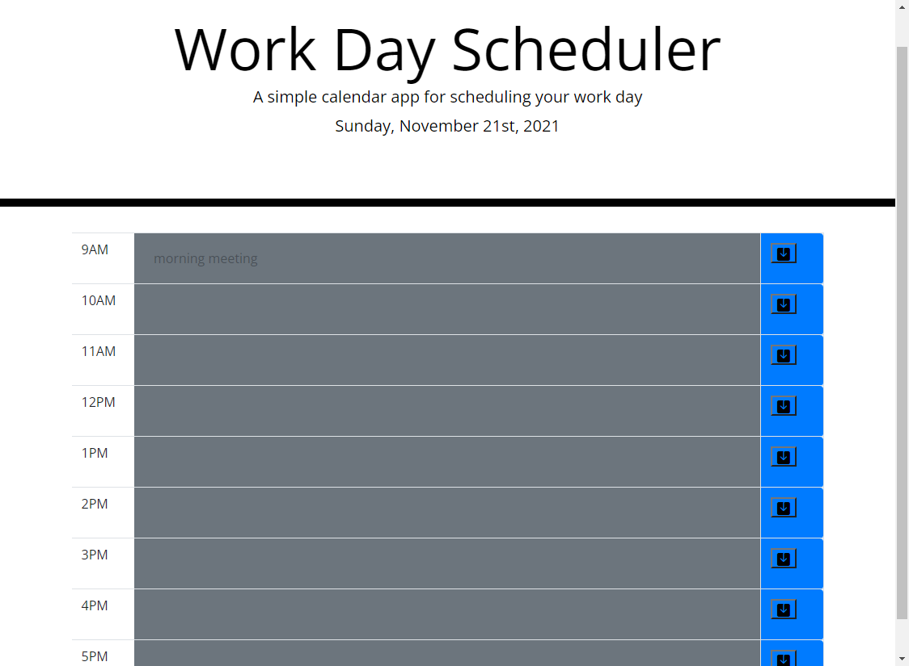

# Third-Party APIs Challenge: Work Day Scheduler

## Purpose 
This assignment is asked to create a simple calendar application that allows a user to save events for each hour of the day. This app will run in the browser and feature dynamically updated HTML and CSS powered by jQuery.

## Build with
* HTML
* CSS
* JavaScript

## Website
https://zhanzhanliu.github.io/work-day-schedule/

## Respository Link
https://github.com/zhanzhanLiu/work-day-schedule

## What to expect
* Current day is displayed at the top of the calendar
* Color of time blocks will change according to the current time
* Click the save button for the time block will save to the local storage
* The saved events persist after refreshing the page

## Screenshots

